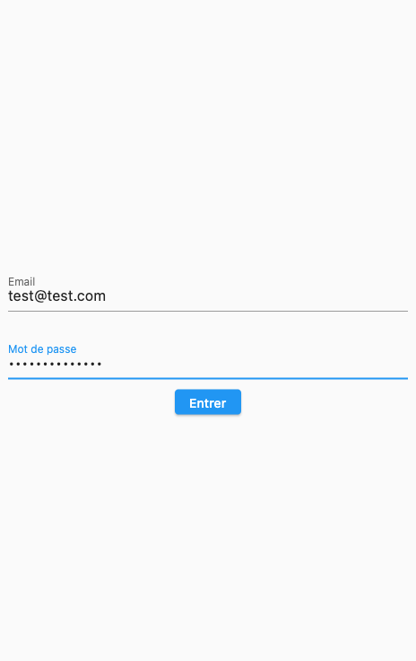
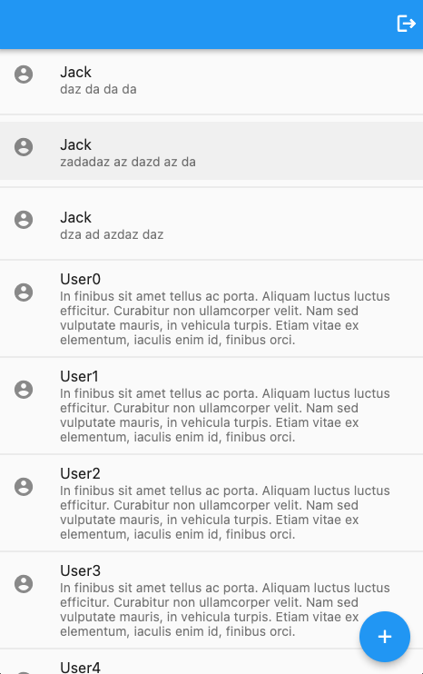
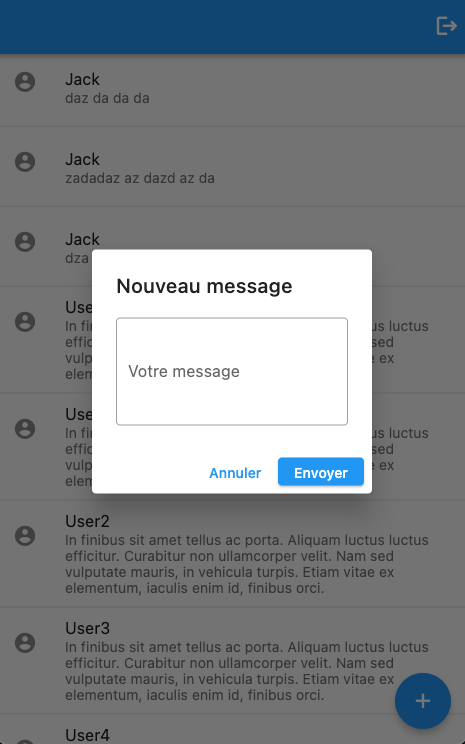
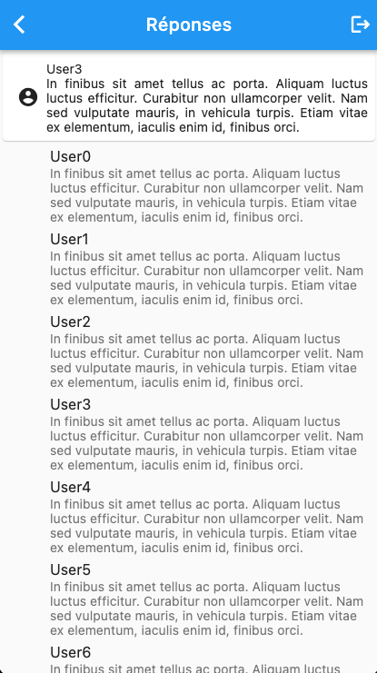

[](https://codecov.io/gh/rxlabz/exemple_feed)

# feed_app

Exemple d'application utilisant :
- [go_router](https://pub.dev/packages/go_router)
- [Provider](https://pub.dev/packages/provider)
- des [ChangeNotifier](https://api.flutter.dev/flutter/foundation/ChangeNotifier-class.html)
- [Freezed](https://pub.dev/packages/freezed)
- [Form](https://api.flutter.dev/flutter/widgets/Form-class.html)

|  |  |  |  |
|------------------------------|-----------------------------|-------------------------------|----------------------------------|


## Utilisation

Avant de lancer l'application, le serveur local dit être démarré `feed_api/bin/server.dart`

## Routing

Trois `GoRoute` sont déclarées :
- /
- /message/:id
- /login

### Authentification

Quand `LoginController.user` est null, le router redirige ( cf. [`Redirects`](https://gorouter.dev/redirection) ) vers l'écran de login.
Cette redirection se fait automatiquement grâce à l'utilisation d'un changeNotifier (loginController) déclaré comme `refreshListenable` du router.

```dart
GoRouter(
  redirect: (state) {
    final user = loginController.user;
    if (user == null && state.subloc != '/login') {
    return '/login';
    }
    
    if (user != null && state.subloc == '/login') {
    return '/';
    }
    
    return null;
  },
  refreshListenable: loginController,
//...
);
```

## Provider et ChangeNotifiers

MainProvider met à disposition AuthController et FeedController

AuthController et FeedController étendent `ChangeNotifier`. Ils jouent le rôle de _ViewModels_.

Ils contiennent une ou plusieurs [AsyncTask](../feed_lib/lib/services/async_task.dart) dont "l'état" ( result, loading, error ) se répercute sur l'UI

```dart
task.when(
  result: (result) => ListView.separated(
    itemCount: result.length,
    itemBuilder: (context, index) {
      final message = result[index];
      return ListTile(
        leading: const Icon(Icons.account_circle),
        title: Text(message.name),
        subtitle: Text(message.message),
        onTap: () => context.push('/message/${message.id}'),
      );
    },
    separatorBuilder: (context, index) => const Divider(),
  ),
  loading: () => const Center(child: CircularProgressIndicator()),
  error: (message) => Center(child: Text(message)),
)
```